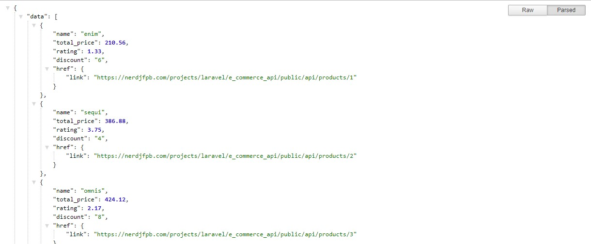
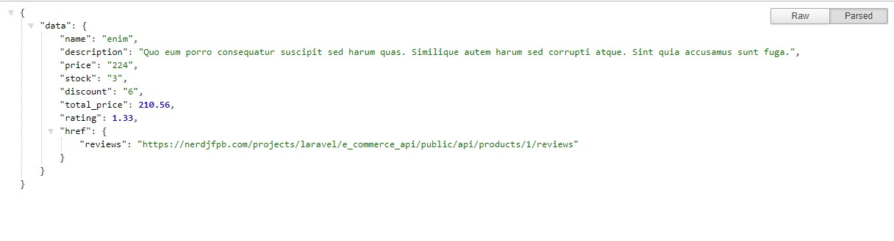
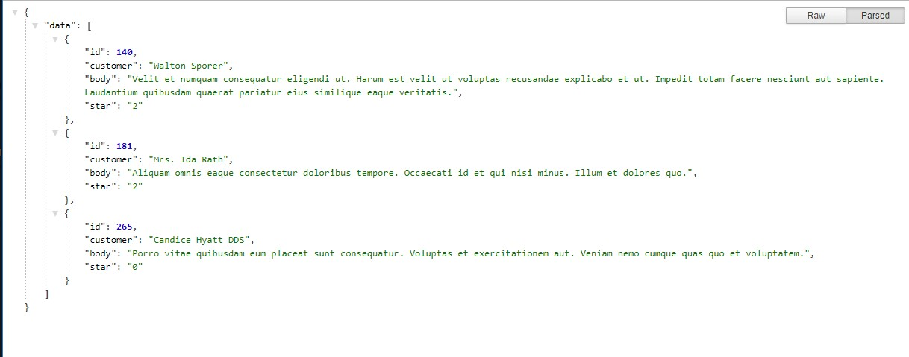

# E Commerce Api Using Faker & Laravel 5.7.22

Building a api using laravel

## Live Link

* [All Products Api](https://nerdjfpb.com/projects/laravel/e_commerce_api/public/api/products) - Products
* [Single Product Api](https://nerdjfpb.com/projects/laravel/e_commerce_api/public/api/products/1) - Single Products
* [Single Product Review Api](https://nerdjfpb.com/projects/laravel/e_commerce_api/public/api/products/1/reviews) - Single Product Review Api

## Feature List
1. Product API - Create, Read, Update, Delete
2. Product Review API - Create, Read, Update, Delete

## Screenshots

### All Products Api

### Single Product Api

### Single Product Review Api

